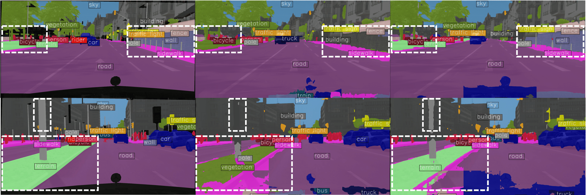

<div align="center">
  
  <div>&nbsp;</div>
  </div>
  <div>&nbsp;</div>

# VocAlign: Source-free Domain Adaptation for Open-vocabulary Semantic Segmentation

In this project we provide a method to perform source-free domain adaptation on CAT-Seg.

### Installation

**Step 1.** Clone the repository with recursive option for the submodule.

**Step 2.** Create a conda environment and activate it:

```shell
conda create --name vocalign python=3.10 -y
conda activate vocalign
```

**Step 3.** Install PyTorch:

```shell
conda install pytorch==1.13.1 torchvision==0.14.1 torchaudio==0.13.1 pytorch-cuda=11.7 -c pytorch -c nvidia
conda install intel-openmp=2023.1.0 mkl=2023.1.0 tbb=2021.8.0 -c anaconda
```

**Step 4.** Install openmim, mmcv, and all the requirements in your conda environment:

```shell
pip install -U openmim
mim install "mmcv==2.1.0"
cd mmengine_adaptation
pip install -v -e .
cd ..
pip install -v -e .
```

### Dataset

```none
VocAlign
├── mmseg
├── tools
├── configs
├── data
│   ├── cityscapes
│   │   ├── cityscapes.json
│   │   ├── cityscapes_guidance.json
│   │   ├── leftImg8bit
│   │   │   ├── train
│   │   │   ├── val
│   │   ├── gtFine
│   │   │   ├── train
│   │   │   ├── val
```
First download cityscapes dataset (leftImg8bit) and ground truth (gtFine) from their [website](https://www.cityscapes-dataset.com/). 
Then in the `data/cityscapes` directory add the `cityscapes.json` and `cityscapes_guidance.json` files.

cityscapes.json is the following:

```none
["road", "sidewalk", "building", "wall", "fence", "pole", "traffic light", "traffic sign", "vegetation", "terrain", "sky", "person", "rider", "car", "truck", "bus", "train", "motorcycle", "bicycle"]
```

cityscapes_guidance.json used in our experiments to achieve the best result was:

```none
["road", "sidewalk", "building", "house", "individual standing wall which is not part of a building", "fence", "hole in fence", "pole", "metal", "railing", "sign pole", "traffic light", "light", "traffic sign", "street sign", "parking sign", "direction sign", "vegetation", "tree", "terrain", "grass", "soil", "sand", "sky", "person", "pedestrian", "rider", "driver", "passenger", "car", "van", "truck", "truck trailer", "bus", "train", "tram", "motorcycle", "scooter", "bicycle"]
```

If you modify the concepts in `cityscapes_guidance` make sure you also modify the `classes_to_concepts` dict(list) assignments in the correspondent config file.

### Run experiments
To resume from pre-trained CAT-Seg, create a folder `work_dirs/cityscapes/`, in this folder create a file `last_checkpoint` and copy paste the path to the checkpoint. The link to download the checkpoint can be found in the README within the `CAT-Seg/` directory.


#### Train VocAlign
```shell
export PYTHONPATH=`pwd`:/*your_path*/CAT-Seg
python tools/train.py configs/vocalign/cityscapes.py --resume
```

#### Evaluate VocAlign
In the config file set `lora_eval` to True. In `last_checkpoint` the path automatically updates at the end of VocAlign training. If you just want to perform inference without previously having conducted the training yourself, just copy paste manually the path to the desired VocAlign checkpoint.

```shell
python tools/test.py configs/vocalign/cityscapes.py work_dirs/cityscapes/best_cityscapes.pth
```

If you want to visualize results generated during evaluation, specify the work_dir and change the `interval` in the `SegVisualizationHook` within the config file before launching the evaluation.

### Other
We based our code on the [mmsegmentation](https://github.com/open-mmlab/mmsegmentation) codebase.